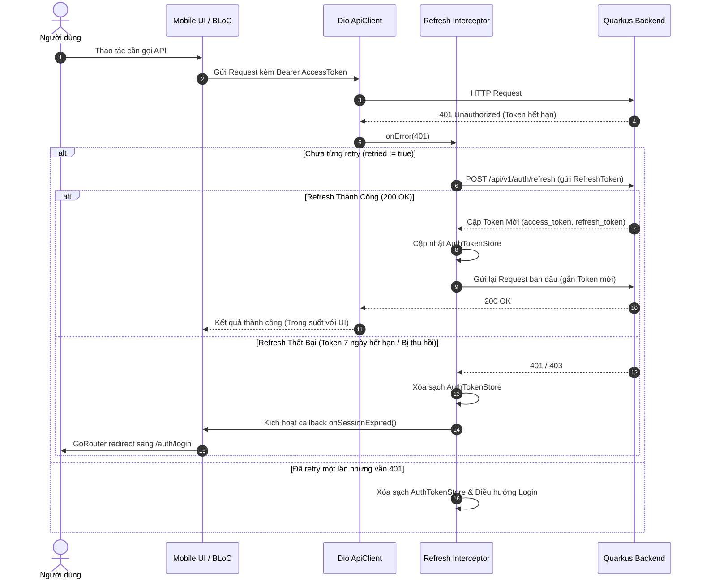

# TÀI LIỆU ĐẶC TẢ KIẾN TRÚC KỸ THUẬT MOBILE (MOBILE ARCHITECTURE SPEC)

> **Dự án:** VSTech Home Services  
> **Phiên bản:** 1.0 (Phase 1 MVP)  
> **Trạng thái:** Đã phê duyệt (Approved)  
> **Hệ quy chiếu:** [`AGENTS.md`](../../AGENTS.md), [`docs/design/MASTER_SPEC_V9.md`](../design/MASTER_SPEC_V9.md), [`docs/reference/PHASE1_SCOPE.md`](PHASE1_SCOPE.md), [`docs/reference/api/00-foundation.md`](api/00-foundation.md).

---

## 1. TỔNG QUAN KIẾN TRÚC & PHÂN TẦNG (FEATURE-FIRST CLEAN ARCHITECTURE)

Ứng dụng tuân thủ mô hình **Feature-First Clean Architecture** kết hợp mẫu quản lý trạng thái **BLoC / Cubit**. Mã nguồn được tổ chức theo module chức năng độc lập tại `lib/features/<feature_name>/`:

```
lib/features/<feature_name>/
├── data/
│   ├── datasources/         # <feature>_remote_datasource.dart (Gọi Dio ApiClient)
│   ├── models/              # Freezed DTOs: tách biệt Request & Response
│   └── repositories/        # <feature>_repository_impl.dart (Hiện thực hóa Domain Repository)
├── domain/
│   ├── entities/            # Plain Dart entities (không chứa json annotation)
│   ├── repositories/        # Abstract <feature>_repository.dart
│   └── usecases/            # 1 UseCase = 1 nghiệp vụ duy nhất, hàm call()
└── presentation/
    ├── bloc/                # BLoC/Cubit + Event + State (Sealed classes)
    ├── pages/               # Widget cấp màn hình (gắn Route)
    └── widgets/             # Widget nội bộ của riêng feature
```

### Nguyên tắc Phụ thuộc (Dependency Inversion):
- `presentation` phụ thuộc `domain` (qua UseCase hoặc Repository Interface).
- `data` phụ thuộc `domain` (hiện thực hóa interface do domain định nghĩa).
- `domain` hoàn toàn độc lập, không phụ thuộc vào `data`, `presentation`, Flutter UI framework hay các thư viện bên thứ ba (ngoại trừ Dart SDK).
- Dependency Injection được tự động quét và sinh mã thông qua `get_it` + `injectable`.

---

## 2. QUẢN LÝ VÒNG ĐỜI PHIÊN ĐĂNG NHẬP & TOKEN (AUTH & TOKEN LIFECYCLE)

### 2.1. Cơ chế Lưu trữ An toàn (Secure Token Storage)
- **Vị trí duy nhất:** `flutter_secure_storage` thông qua lớp [`AuthTokenStore`](../../lib/core/network/auth_token_store.dart).
- **Tuyệt đối cấm:** Lưu Access Token hoặc Refresh Token trong `SharedPreferences` hoặc `Hive` không mã hóa.
- **Thời hạn Token (TTL):**
  - `access_token`: 15 phút (Bearer JWT).
  - `refresh_token`: 7 ngày.

### 2.2. Interceptor Tự Động Refresh Token Trong Suốt (Transparent Token Refresh)
Cơ chế xử lý mã lỗi `401 Unauthorized` tại lớp [`ApiClient`](../../lib/core/network/api_client.dart):



### 2.3. Điều Hướng Theo Vai Trò (Role-Aware Routing)
- Sau khi xác thực thành công (hoặc khi mở lại ứng dụng từ cold-start), `GoRouter` kiểm tra quyền trong token/profile:
  - Role `CUSTOMER`: Chuyển hướng tới `/home` (Trang chủ khách hàng).
  - Role `WORKER`: Chuyển hướng tới `/worker/dashboard` (Sảnh làm việc thợ).
- Không đặt điều kiện phân quyền rải rác ở tầng Widget. Mọi kiểm tra quyền thuộc về `redirect` callback của `GoRouter`.

---

## 3. KIẾN TRÚC KẾT NỐI REALTIME (WEBSOCKET / STOMP LIFECYCLE)

### 3.1. Giao Thức & Cấu Hình
- **Giao thức:** STOMP over WebSocket (sử dụng package `stomp_dart_client`).
- **Endpoint kết nối:** `ws://<base_url>/ws` hoặc `wss://<base_url>/ws`.
- **Xác thực:** Gửi Header `Authorization: Bearer <access_token>` trong khung STOMP `CONNECT`.

### 3.2. Vòng Đời Kết Nối Gắn Liền Với BLoC (BLoC-Scoped Lifecycle)
Để tối ưu pin và RAM cho thiết bị di động, ứng dụng **không duy trì kết nối WebSocket toàn cục vô tận**, mà quản lý theo vòng đời của màn hình/BLoC cần realtime:

| Tính năng | BLoC sở hữu | Topic STOMP đăng ký | Hành động khi đóng BLoC (`close()`) |
| :--- | :--- | :--- | :--- |
| **Theo dõi Đơn hàng & GPS** | `BookingTrackingBloc` | `/topic/booking/{bookingId}` | Unsubscribe topic & Ngắt kết nối STOMP |
| **Sảnh nhận việc Thợ** | `WorkerDispatchBloc` | `/topic/worker/{workerId}/dispatch` | Unsubscribe topic & Ngắt kết nối STOMP |
| **Chat thời gian thực** | `ChatBloc` | `/topic/chat/{roomId}` | Unsubscribe topic & Ngắt kết nối STOMP |

### 3.3. Tự Động Kết Nối Lại & Giám Sát Mạng (Auto Reconnect)
- Sử dụng `connectivity_plus` để lắng nghe trạng thái kết nối mạng của thiết bị.
- Khi mạng chuyển từ `none` $\to$ `wifi`/`mobile`: BLoC tự động kích hoạt tiến trình tái kết nối STOMP.
- Cấu hình Heartbeat: `stomp_dart_client` gửi ping định kỳ mỗi 10 giây để phát hiện đứt kết nối ngầm (Half-open connection).

---

## 4. CHUẨN HÓA QUẢN LÝ TRẠNG THÁI (BLOC & CUBIT PATTERNS)

### 4.1. Tiêu Chí Chọn Cubit vs BLoC
- **Dùng Cubit khi:** Màn hình quản lý trạng thái đơn giản, tương tác 1 chiều (Settings, xem danh sách địa chỉ, xem chi tiết hồ sơ thợ/khách).
- **Dùng BLoC khi:** Luồng nghiệp vụ có nhiều bước, chuyển đổi phức tạp, hoặc chịu tác động từ nhiều nguồn sự kiện bất đồng bộ (Luồng Booking, Luồng Khớp việc, Luồng Tracking GPS, Luồng Xác thực OTP).

### 4.2. Cấu Trúc Trạng Thái Phân Cấp (Sealed Class State Pattern - Dart 3+)
Mọi BLoC/Cubit đều định nghĩa trạng thái dưới dạng `sealed class` khép kín:

```dart
sealed class BookingState {
  const BookingState();
}

final class BookingInitialState extends BookingState {
  const BookingInitialState();
}

final class BookingLoadingState extends BookingState {
  const BookingLoadingState();
}

final class BookingLoadedState extends BookingState {
  const BookingLoadedState({required this.booking});
  final Booking booking;
}

final class BookingFailureState extends BookingState {
  const BookingFailureState({required this.message, this.errorCode});
  final String message;
  final String? errorCode;
}
```

*Tuyệt đối cấm:* Sử dụng các class chứa hàng loạt cờ bool rời rạc (`bool isLoading`, `bool isSuccess`, `bool isError`) gây lỗi race condition và khó kiểm soát trạng thái UI.

---

## 5. CƠ CHẾ IDEMPOTENCY & BẢO VỆ GIAO DỊCH (IDEMPOTENT TRANSACTIONS)

### 5.1. Bắt Buộc Gắn Idempotency Key
Mọi API `POST` làm thay đổi trạng thái nhạy cảm (Tạo đơn đặt, Thanh toán, Rút tiền ví, Check-in hiện trường, Báo giá phát sinh) **bắt buộc** phải đính kèm Header:
```http
X-Idempotency-Key: <UUID-v4>
```
Được sinh tự động qua tiện ích [`IdempotencyKey.generate()`](../../lib/core/utils/idempotency_key.dart). Nếu thiếu header này, backend sẽ từ chối với lỗi `HS-400-0011`.

### 5.2. Chống Bấm Đúp Phía Client (Double-Tap Prevention)
Widget chuẩn [`AppButton`](../../lib/core/widgets/app_button.dart) tự động vô hiệu hóa `onPressed` khi `isLoading == true` hoặc áp dụng cơ chế throttle 500ms để ngăn chặn người dùng bấm liên tục gây trùng lặp request.

---

## 6. CHIẾN LƯỢC LƯU TRỮ BỘ NHỚ ĐỆM & NGOẠI TUYẾN (OFFLINE & CACHING STRATEGY)

> [!NOTE]
> **Trạng thái:** Tạm hoãn chi tiết (TBD - Theo thống nhất ngày 23/09/2026). Sẽ hoàn thiện sau khi triển khai xong UI và các luồng nghiệp vụ cốt lõi.

- **Định hướng công nghệ:** `hive_flutter`.
- **Nguyên tắc sơ bộ:**
  - Dữ liệu tĩnh/bán tĩnh (Cây danh mục dịch vụ `categories`, danh sách địa chỉ nhà của khách) sẽ được lưu cache để mở app tức thì.
  - Dữ liệu tài chính, số dư ví, đơn đang theo dõi GPS: **Không cache** để đảm bảo tính toàn vẹn dữ liệu.

---

## 7. CƠ CHẾ XỬ LÝ LỖI TẬP TRUNG (LOCALIZED ERROR MAPPING)

Mọi phản hồi lỗi từ mạng được chuẩn hóa theo mã `HS-XXX-XXXX` (Catalog [`docs/reference/api/11-appendices.md`](api/11-appendices.md)). Tầng Repository có nhiệm vụ map mã kỹ thuật sang câu thông báo tiếng Việt trước khi đẩy lên UI:

| Mã lỗi Backend | Ý nghĩa kỹ thuật | Thông báo hiển thị trên Mobile UI |
| :--- | :--- | :--- |
| `HS-400-0001` | Invalid phone number format | *"Số điện thoại không đúng định dạng. Vui lòng kiểm tra lại."* |
| `HS-400-0002` | Invalid OTP code | *"Mã xác thực OTP không chính xác."* |
| `HS-400-0003` | OTP expired | *"Mã OTP đã hết hạn. Vui lòng bấm gửi lại mã."* |
| `HS-401-0001` | Invalid credentials | *"Số điện thoại hoặc mật khẩu không chính xác."* |
| `HS-401-0002` | Token expired | *"Phiên làm việc đã hết hạn. Đang đăng nhập lại..."* |
| `HS-409-0001` | Booking already accepted | *"Đơn việc này đã được đối tác khác nhận."* |
| `HS-409-0002` | Booking already cancelled | *"Đơn dịch vụ này đã bị hủy bỏ trước đó."* |
| `HS-402-0001` | Insufficient wallet balance | *"Số dư ví không đủ để nhận đơn. Vui lòng nạp thêm tiền."* |
| `SocketException` | Mất kết nối Internet | *"Không có kết nối mạng. Vui lòng kiểm tra WiFi hoặc 4G."* |

---

## 8. HỆ SINH THÁI THƯ VIỆN NỀN TẢNG (CORE LIBRARY ECOSYSTEM)

| Danh mục | Thư viện | Vai trò kỹ thuật & Quy ước |
| :--- | :--- | :--- |
| **Ghi log** | `logger: ^2.8.0` | [`lib/core/utils/logger.dart`](../../lib/core/utils/logger.dart) (`appLogger`). Không dùng lệnh `print()` trực tiếp. |
| **Log mạng HTTP** | `pretty_dio_logger: ^1.4.0` | In log đầy đủ Request/Response/Header khi chạy ở chế độ Debug. |
| **Chụp ảnh & File** | `image_picker: ^1.2.3` | Mở camera/thư viện chụp ảnh hiện trường, linh kiện hỏng, CCCD. |
| **Định dạng số & ngày** | `intl: ^0.20.2` | Format tiền tệ VND (`250.000 đ`) và ngày giờ (`dd/MM/yyyy HH:mm`). |
| **Quản lý quyền** | `permission_handler: ^11.4.0` | Yêu cầu cấp quyền Camera, Vị trí (GPS), Microphone (VoIP), Thông báo (FCM). |
| **Định vị GPS** | `geolocator: ^13.0.2` | Thu thập tọa độ GPS thực tế của thợ để broadcast vị trí mỗi 2s (`09-location-tracking.md`). |
| **Bản đồ** | `google_maps_flutter: ^2.18.1` | Hiển thị bản đồ theo dõi vị trí thợ đang di chuyển đến nhà khách. |
| **Tiện ích hệ thống** | `url_launcher: ^6.3.1` | Mở ứng dụng gọi điện thoại (`tel:`), chỉ đường ngoài (`geo:`), deep link thanh toán. |
| **Trạng thái mạng** | `connectivity_plus: ^6.1.4` | Giám sát trạng thái mạng để tự động kết nối lại WebSocket STOMP. |
