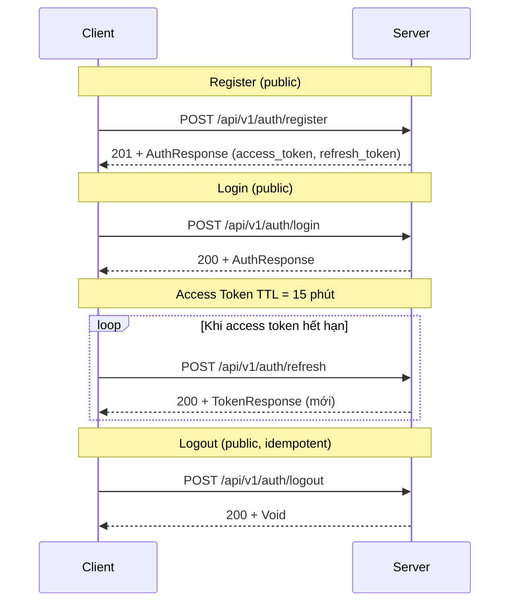

# Foundation — Quy ước Chung cho Mobile Developer

## Tổng quan
Tài liệu này định nghĩa các quy ước kỹ thuật chung mà mọi phần mềm mobile phải tuân thủ để tương thích với backend HomeService.

---

## 1. ApiResponse<T> — Response Wrapper

Mọi endpoint đều bọc response trong `ApiResponse<T>`:

```json
{
  "status": 200,              // int: HTTP status code (200, 201, 400, 404, 500...)
  "message": "Mô tả ngắn",
  "data": { ... },           // null khi error
  "errorCode": "HS-XXX-XXXX", // null khi success
  "timestamp": "2026-08-11T10:30:00Z"
}
```

### Quy tắc phân biệt
- **Success:** `errorCode == null` và `status` trong khoảng 200–299
- **Error:** `errorCode != null` và `status` là mã lỗi HTTP (400, 401, 403, 404, 500…)
- **Lưu ý:** `status` là **số nguyên** (int), KHÔNG phải string

### Dart Model
```dart
class ApiResponse<T> {
  final int status;           // HTTP status code: 200/201/400/404/500...
  final String? message;
  final T? data;
  final String? errorCode;
  final DateTime timestamp;
}
```

### Xử lý lỗi
- Kiểm tra `errorCode` trước khi lấy `data`
- Map `errorCode` sang message UI tiếng Việt (xem bảng error codes bên dưới)
- Không hiển thị raw `errorCode` cho người dùng cuối

---

## 2. Error Code Catalog (41 mã)

| Code | HTTP Status | Mô tả | Gợi ý xử lý UI |
|---|---|---|---|
| **HS-400-0001** | 400 | Input không hợp lệ | Hiển thị lỗi validation cụ thể từ `message` |
| **HS-400-0002** | 400 | Thời gian đặt lịch không hợp lệ | "Thời gian đặt lịch phải ở tương lai" |
| **HS-400-0003** | 400 | Tọa độ không hợp lệ | "Vui lòng chọn vị trí chính xác" |
| **HS-400-0010** | 400 | Chuyển trạng thái không hợp lệ | "Không thể thực hiện thao tác này ở trạng thái hiện tại" |
| **HS-400-0011** | 400 | Thiếu header X-Idempotency-Key | "Thiếu mã xác nhận giao dịch" |
| **HS-400-0012** | 400 | Giá vượt quá giới hạn | "Giá không được vượt quá [giới hạn]" |
| **HS-400-0013** | 400 | Đặt lịch đã hoàn thành | "Đặt lịch này đã hoàn thành" |
| **HS-400-0014** | 400 | Tranh chấp không hợp lệ | "Không thể tạo tranh chấp cho đặt lịch này" |
| **HS-400-0015** | 400 | Giải quyết tranh chấp không hợp lệ | "Giải quyết tranh chấp không hợp lệ" |
| **HS-400-0020** | 400 | Số dư không đủ | "Số dư ví không đủ để thực hiện giao dịch" |
| **HS-400-0021** | 400 | Yêu cầu rút tiền trạng thái không hợp lệ | "Yêu cầu rút tiền đã được xử lý" |
| **HS-400-0022** | 400 | Mật khẩu yếu | "Mật khẩu phải có ít nhất 8 ký tự, bao gồm chữ hoa, chữ thường và số" |
| **HS-400-0030** | 400 | Loại thiết bị không hợp lệ | "Loại thiết bị không được hỗ trợ" |
| **HS-400-0031** | 400 | Cập nhật tài sản không có trường nào | "Vui lòng chọn ít nhất một trường để cập nhật" |
| **HS-401-0001** | 401 | Chưa xác thực | "Vui lòng đăng nhập lại" → redirect login |
| **HS-401-0002** | 401 | Thông tin đăng nhập sai | "Email hoặc mật khẩu không chính xác" |
| **HS-403-0001** | 403 | Không có quyền truy cập | "Bạn không có quyền thực hiện thao tác này" |
| **HS-403-0004** | 403 | Chat room không có quyền | "Bạn không có quyền truy cập đoạn chat này" |
| **HS-403-0005** | 403 | VoIP log không có quyền | "Bạn không có quyền xem thông tin cuộc gọi" |
| **HS-403-0006** | 403 | Notification không có quyền | "Bạn không có quyền truy cập thông báo này" |
| **HS-404-0001** | 404 | Không tìm thấy tài nguyên | "Không tìm thấy dữ liệu yêu cầu" |
| **HS-404-0002** | 404 | Không tìm thấy hồ sơ | "Không tìm thấy hồ sơ người dùng" |
| **HS-404-0003** | 404 | Không tìm thấy danh mục | "Không tìm thấy danh mục dịch vụ" |
| **HS-404-0010** | 404 | Không tìm thấy đặt lịch | "Không tìm thấy đặt lịch" |
| **HS-404-0011** | 404 | Không tìm thấy dispatch | "Không tìm thấy thông tin phân công" |
| **HS-404-0020** | 404 | Không tìm thấy ví | "Không tìm thấy ví tiền" |
| **HS-404-0021** | 404 | Không tìm thấy yêu cầu rút tiền | "Không tìm thấy yêu cầu rút tiền" |
| **HS-404-0030** | 404 | Không tìm thấy tài sản | "Không tìm thấy tài sản" |
| **HS-409-0001** | 409 | Xung đột hồ sơ | "Hồ sơ đã tồn tại" |
| **HS-409-0002** | 409 | Người dùng đã tồn tại / Xung đột ví | "Tài khoản đã tồn tại" hoặc "Giao dịch đang được xử lý, vui lòng thử lại" |
| **HS-409-0003** | 409 | Tài sản còn bảo hành active | "Tài sản đang có bảo hành, không thể xóa" |
| **HS-409-0005** | 409 | Chat room đã đóng | "Đoạn chat đã kết thúc" |
| **HS-409-0006** | 409 | Tên danh mục trùng | "Tên danh mục đã tồn tại" |
| **HS-409-0007** | 409 | Danh mục đang được sử dụng | "Danh mục đang có đặt lịch, không thể xóa" |
| **HS-429-0001** | 429 | Vượt quá giới hạn request | "Bạn thực hiện quá nhanh, vui lòng thử lại sau" |
| **HS-500-0001** | 500 | Lỗi hệ thống | "Đã có lỗi xảy ra, vui lòng thử lại sau" |
| **HS-503-0001** | 503 | Dispatch không khả dụng | "Hệ thống phân công tạm thời không khả dụng" |

### Lưu ý xử lý error
- **HS-409-0002:** Phân biệt theo context:
  - Auth context → "Tài khoản đã tồn tại"
  - Wallet context → "Giao dịch đang được xử lý, vui lòng thử lại"
- **HS-400-0011:** Bắt buộc phải có header `X-Idempotency-Key` cho POST state-change endpoints
- **HS-429-0001:** Implement retry với exponential backoff

---

## 3. Auth Flow Chi Tiết

### 3.1. Overview


### 3.2. Token Management
- **Access Token:** TTL 15 phút, lưu trong secure storage
- **Refresh Token:** TTL 7 ngày, lưu trong secure storage
- **Issuer:** `https://homeservice.local`
- **Algorithm:** RSA (MP-JWT)

### 3.3. Mock Auth (CHỈ Dev/Test)
- Format: `Bearer mock-token-<role>-<id>`
- Ví dụ: `Bearer mock-token-worker-9`
- **KHÔNG BAO GIỜ** dùng ở production

### 3.4. Secure Storage Khuyến Nghị
- Sử dụng `flutter_secure_storage` (iOS Keychain / Android Keystore)
- KHÔNG dùng `SharedPreferences` cho auth token
- Lưu cả access token và refresh token

### 3.5. Auto-Refresh Logic
```dart
// Pseudo-code
if (isAccessTokenExpired()) {
  final newTokens = await refreshToken();
  if (newTokens != null) {
    await saveTokens(newTokens);
    return await retryRequest();
  } else {
    await logout();
    redirectToLogin();
  }
}
```

---

## 4. BigDecimal / Money Handling

- Backend trả về BigDecimal dạng string-number: `"200000"`
- KHÔNG có dấu phân cách (không dùng `200,000`)
- **Dart:** Sử dụng `num` hoặc package `decimal` cho chính xác
- **Hiển thị:** Format theo locale tiếng Việt: `200.000 VNĐ`

```dart
// Ví dụ parse
final amount = num.parse(response.data.amount); // "200000" → 200000

// Hiển thị
final formatted = NumberFormat.currency(locale: 'vi_VN', symbol: 'VNĐ')
    .format(amount); // "200.000 VNĐ"
```

---

## 5. Idempotency Key

- **Bắt buộc** cho tất cả POST state-change endpoints
- Header: `X-Idempotency-Key: <uuid>`
- Thiếu → lỗi `HS-400-0011`
- UUID generate phía client (package `uuid`)

---

## 6. Time Handling

- Backend sử dụng **UTC** cho tất cả timestamp
- Format: ISO 8601 (`2026-08-11T10:30:00Z`)
- **Dart:** Sử dụng `DateTime.utc()` và convert sang local khi hiển thị
- **Lưu ý:** `scheduledTime` trong booking cũng là UTC

---

## 7. Enum Values

### 7.1. UserRole
```dart
enum UserRole {
  customer('CUSTOMER'),
  b2bCustomer('B2B_CUSTOMER'),
  worker('WORKER'),
  supplier('SUPPLIER'),
  admin('ADMIN');
  
  final String value;
  const UserRole(this.value);
}
```

### 7.2. BookingStatus
```dart
enum BookingStatus {
  pending('PENDING'),
  accepted('ACCEPTED'),
  inProgress('IN_PROGRESS'),
  completed('COMPLETED'),
  cancelled('CANCELLED'),
  dispute('DISPUTE'),
  dispatchFailed('DISPATCH_FAILED');
  
  final String value;
  const BookingStatus(this.value);
}
```

### 7.3. TransactionType
```dart
enum TransactionType {
  deposit('DEPOSIT'),
  commission('COMMISSION'),
  earning('EARNING'),
  tip('TIP'),
  withdrawal('WITHDRAWAL'),
  refund('REFUND');
  
  final String value;
  const TransactionType(this.value);
}
```

### 7.4. TransactionStatus
```dart
enum TransactionStatus {
  pending('PENDING'),
  completed('COMPLETED'),
  failed('FAILED');
  
  final String value;
  const TransactionStatus(this.value);
}
```

### 7.5. WalletType
```dart
enum WalletType {
  user('USER'),
  platform('PLATFORM'),
  supplier('SUPPLIER');
  
  final String value;
  const WalletType(this.value);
}
```

### 7.6. WithdrawalStatus
```dart
enum WithdrawalStatus {
  pendingApproval('PENDING_APPROVAL'),
  approved('APPROVED'),
  rejected('REJECTED'),
  cancelled('CANCELLED');
  
  final String value;
  const WithdrawalStatus(this.value);
}
```

### 7.7. ApplianceType
```dart
enum ApplianceType {
  airConditioner('AIR_CONDITIONER', 'Máy lạnh'),
  refrigerator('REFRIGERATOR', 'Tủ lạnh'),
  washingMachine('WASHING_MACHINE', 'Máy giặt'),
  dishwasher('DISHWASHER', 'Máy rửa bát'),
  waterHeater('WATER_HEATER', 'Máy nước nóng'),
  electricStove('ELECTRIC_STOVE', 'Bếp điện'),
  microwave('MICROWAVE', 'Lò vi sóng'),
  other('OTHER', 'Khác');
  
  final String value;
  final String displayName;
  const ApplianceType(this.value, this.displayName);
}
```

### 7.8. NotificationType
```dart
enum NotificationType {
  system('SYSTEM'),
  booking('BOOKING'),
  promo('PROMO');
  
  final String value;
  const NotificationType(this.value);
}
```

---

## 8. Paged Response

### 8.1. Standard PagedResponse
```dart
class PagedResponse<T> {
  final List<T> content;
  final int page;
  final int size;
  final int totalItems;
  final int totalPages;
}
```

### 8.2. Lưu ý quan trọng
- **ChatMessagePage** và **NotificationPage** KHÔNG dùng `PagedResponse`
- Chúng chỉ có list trực tiếp:
  ```json
  { "messages": [...] }
  { "notifications": [...] }
  ```
- **KHÔNG** có `page`, `size`, `totalItems`, `totalPages`

---

## 9. Cạm Bẫy Đã Phát Hiện

### 9.1. Chat roomId đồng nhất Long
- **REST Chat:** `GET|POST /api/v1/chat/rooms/{roomId}/messages` — roomId là **Long** (số, ví dụ `/api/v1/chat/rooms/12345/messages`)
- **WebSocket:** `ws://host/ws/chat/{roomId}` — roomId cũng là **Long** (số, ví dụ `/ws/chat/12345`)
- **Lưu ý:** `roomId` là **Long** duy nhất cho cả REST lẫn WebSocket — lưu 1 giá trị, dùng cho cả hai kênh, KHÔNG cần mapping/convert.

### 9.2. Path Profiles
- **ĐÚNG:** `/api/v1/profiles`
- **SAI:** `/api/v1/users`

### 9.3. Wallet Payments Endpoint
- **KHÔNG** tồn tại `POST /api/v1/wallets/payments`
- **CHỈ** có:
  - `POST /api/v1/wallets/payments/deposit`
  - `POST /api/v1/wallets/payments/withdraw`

### 9.4. TechnicianId bị Server Ignore
- Ở `PUT /api/v1/technician/location`, server **ignore** field `technicianId` trong request body
- Server lấy ID từ JWT token, không cho phép impersonation

### 9.5. ChatMessagePage/NotificationPage không có Pagination
- Như đã nói ở mục 8.2, hai response này không có metadata pagination
- Client cần implement "load more" thủ công

### 9.6. Backend chưa có FCM
- Notification chỉ persist trong database
- Mobile tự xử lý Firebase client-side
- **KHÔNG** giả định backend hỗ trợ push notification

### 9.7. Mock Auth chỉ Dev/Test
- CHỈ dùng `Bearer mock-token-<role>-<id>` ở môi trường development/test
- Production **BẮT BUỘC** JWT thật
- Implement check environment để enforce

---

## 10. Cấu Trúc Khuyến Nghị cho Mobile App

```
mobile_app/lib/
├── core/
│   ├── api/
│   │   ├── api_client.dart
│   │   ├── api_interceptors.dart
│   │   └── api_endpoints.dart
│   ├── models/
│   │   ├── api_response.dart
│   │   ├── paged_response.dart
│   │   └── error_codes.dart
│   ├── storage/
│   │   └── secure_storage.dart
│   └── utils/
│       ├── date_utils.dart
│       └── currency_utils.dart
├── features/
│   ├── auth/
│   │   ├── data/
│   │   ├── domain/
│   │   └── presentation/
│   ├── bookings/
│   │   ├── data/
│   │   ├── domain/
│   │   └── presentation/
│   └── ...
└── main.dart
```

---

## Tài liệu liên quan
- [01-auth-profiles.md](./01-auth-profiles.md) — Chi tiết Auth + Profiles
- [07-chat.md](./07-chat.md) — WebSocket Chat
- [Mobile Dev Rules](../rules/MOBILE_DEV_RULES.md) — Quy tắc phát triển mobile