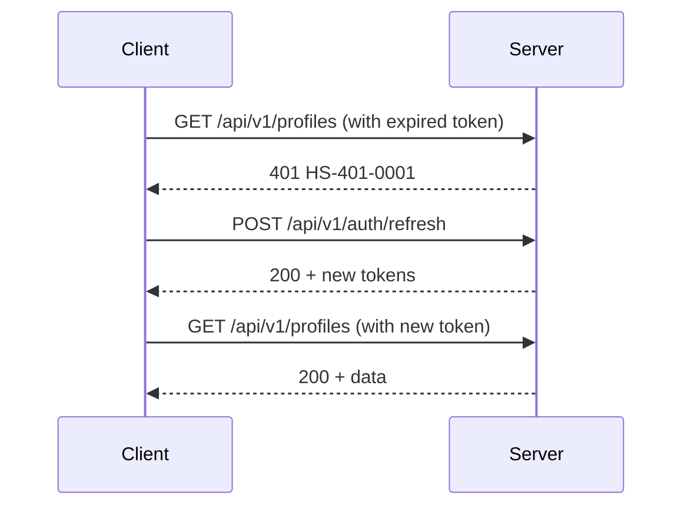

# Auth & Profiles — API Reference

## Tổng quan
Module này xử lý xác thực người dùng (đăng ký, đăng nhập, refresh token, đăng xuất) và quản lý hồ sơ cá nhân.

---

## 1. Auth Endpoints

### 1.1. Register
**POST** `/api/v1/auth/register`

| Thuộc tính | Giá trị |
|---|---|
| **Auth** | Public (không cần token) |
| **Request** | `RegisterRequest` |
| **Success** | 201 + `ApiResponse<AuthResponse>` |
| **Errors** | HS-400-0001, HS-400-0022, HS-409-0002 |

**Request Body:**
```json
{
  "email": "user@example.com",           // required
  "phone": "0901234567",                 // required
  "password": "Password123",             // required
  "fullName": "Nguyễn Văn A",           // required
  "role": "CUSTOMER"                     // required: CUSTOMER | WORKER
}
```

**Password Validation:**
- Regex: `^(?=.*[a-z])(?=.*[A-Z])(?=.*\d).{8,}$`
- Ít nhất 8 ký tự
- Ít nhất 1 chữ hoa, 1 chữ thường, 1 số
- Không hợp lệ → `HS-400-0022`

**Response:**
```json
{
  "status": 201,
  "data": {
    "accessToken": "eyJhbGciOiJSUzI1NiIs...",
    "refreshToken": "dGhpcyBpcyBhIHJlZnJl...",
    "expiresIn": 900,
    "tokenType": "Bearer",
    "user": {
      "id": "uuid",
      "email": "user@example.com",
      "fullName": "Nguyễn Văn A",
      "role": "CUSTOMER"
    }
  }
}
```

**Dart Model:**
```dart
class RegisterRequest {
  final String email;
  final String phone;
  final String password;
  final String fullName;
  final UserRole role;
}

class AuthResponse {
  final String accessToken;
  final String refreshToken;
  final int expiresIn;
  final String tokenType;
  final UserSummary user;
}
```

---

### 1.2. Login
**POST** `/api/v1/auth/login`

| Thuộc tính | Giá trị |
|---|---|
| **Auth** | Public |
| **Request** | `LoginRequest` |
| **Success** | 200 + `ApiResponse<AuthResponse>` |
| **Errors** | HS-401-0002 |

**Request Body:**
```json
{
  "identifier": "user@example.com",  // required (email hoặc phone)
  "password": "Password123"          // required
}
```

**Response:** Giống `AuthResponse` ở trên

**Lưu ý:**
- `identifier` có thể là email hoặc số điện thoại
- Sai thông tin → `HS-401-0002`

---

### 1.3. Refresh Token
**POST** `/api/v1/auth/refresh`

| Thuộc tính | Giá trị |
|---|---|
| **Auth** | Public |
| **Request** | `RefreshRequest` |
| **Success** | 200 + `ApiResponse<TokenResponse>` |

**Request Body:**
```json
{
  "refreshToken": "dGhpcyBpcyBhIHJlZnJl..."  // required
}
```

**Response:**
```json
{
  "status": 200,
  "data": {
    "accessToken": "eyJhbGciOiJSUzI1NiIs...",
    "refreshToken": "dGhpcyBpcyBhIHJlZnJl...",
    "expiresIn": 900,
    "tokenType": "Bearer"
  }
}
```

**Flow Auto-Refresh:**


---

### 1.4. Logout
**POST** `/api/v1/auth/logout`

| Thuộc tính | Giá trị |
|---|---|
| **Auth** | Public (không cần token) |
| **Request** | `LogoutRequest` |
| **Success** | 200 + `ApiResponse<Void>` |
| **Idempotent** | Có (gửi nhiều lần không lỗi) |

**Request Body:**
```json
{
  "refreshToken": "dGhpcyBpcyBhIHJlZnJl..."  // required
}
```

**Lưu ý:**
- Endpoint public nhưng cần gửi `refreshToken` để server xóa khỏi Redis
- Sau logout, client phải xóa token khỏi secure storage

---

## 2. Profiles Endpoints

### 2.1. Lấy Hồ Sơ Hiện Tại
**GET** `/api/v1/profiles`

| Thuộc tính | Giá trị |
|---|---|
| **Auth** | Bearer JWT |
| **Success** | 200 + `ApiResponse<UserProfileResponse>` |
| **Errors** | HS-401-0001, HS-404-0002 |

**Response:**
```json
{
  "status": 200,
  "data": {
    "id": "uuid",
    "identityId": "uuid",
    "email": "user@example.com",
    "phoneNumber": "0901234567",
    "fullName": "Nguyễn Văn A",
    "avatarUrl": "https://...",
    "bio": "Mô tả ngắn",
    "role": "CUSTOMER",
    "verificationStatus": "UNVERIFIED",
    "rating": 4.5,
    "totalJobs": 10,
    "locale": "vi-VN",
    "isActive": true,
    "createdAt": "2026-08-11T10:30:00Z",
    "userProfile": {
      "defaultAddress": "123 Đường ABC, Quận 1",
      "lat": 10.762622,
      "lng": 106.660172
    },
    "workerKyc": null,
    "workerMetrics": null,
    "workerSkills": []
  }
}
```

**Dart Model:**
```dart
class UserProfileResponse {
  final String id;
  final String identityId;
  final String email;
  final String phoneNumber;
  final String fullName;
  final String? avatarUrl;
  final String? bio;
  final UserRole role;
  final String verificationStatus;
  final num? rating;
  final int? totalJobs;
  final String locale;
  final bool isActive;
  final DateTime createdAt;
  final UserProfile? userProfile;
  final WorkerKyc? workerKyc;
  final WorkerMetrics? workerMetrics;
  final List<String> workerSkills;
}
```

---

### 2.2. Cập Nhật Hồ Sơ
**PUT** `/api/v1/profiles`

| Thuộc tính | Giá trị |
|---|---|
| **Auth** | Bearer JWT |
| **Request** | `UserProfileUpdateRequest` |
| **Success** | 200 + `ApiResponse<UserProfileResponse>` |
| **Errors** | HS-400-0001, HS-409-0001 |

**Request Body:**
```json
{
  "fullName": "Nguyễn Văn B",        // optional
  "avatarUrl": "https://...",        // optional
  "bio": "Mô tả mới",               // optional
  "locale": "en-US",                 // optional
  "userProfile": {                   // optional
    "defaultAddress": "456 Đường XYZ",
    "lat": 10.762622,
    "lng": 106.660172
  }
}
```

**Lưu ý:**
- Chỉ gửi các field cần cập nhật
- `role` không thể thay đổi qua endpoint này
- `verificationStatus` chỉ thay đổi bởi admin

---

## 3. Token Flow Chi Tiết

### 3.1. Lưu Token
```dart
class SecureTokenStorage {
  final FlutterSecureStorage _storage;
  
  Future<void> saveTokens(AuthResponse auth) async {
    await _storage.write(key: 'access_token', value: auth.accessToken);
    await _storage.write(key: 'refresh_token', value: auth.refreshToken);
    await _storage.write(key: 'token_expiry', value: auth.expiresIn.toString());
  }
  
  Future<String?> getAccessToken() async {
    return await _storage.read(key: 'access_token');
  }
}
```

### 3.2. Auto-Refresh với Interceptor
```dart
class AuthInterceptor extends Interceptor {
  final SecureTokenStorage _storage;
  final Dio _dio;
  
  @override
  void onError(DioException err, ErrorInterceptorHandler handler) async {
    if (err.response?.statusCode == 401) {
      final refreshToken = await _storage.getRefreshToken();
      if (refreshToken != null) {
        try {
          final newTokens = await _refreshToken(refreshToken);
          await _storage.saveTokens(newTokens);
          
          // Retry request với token mới
          err.requestOptions.headers['Authorization'] = 
              'Bearer ${newTokens.accessToken}';
          final response = await _dio.fetch(err.requestOptions);
          handler.resolve(response);
          return;
        } catch (e) {
          // Refresh fail → logout
          await _storage.clearTokens();
          // Redirect to login
        }
      }
    }
    handler.next(err);
  }
}
```

### 3.3. Mock Auth (Dev/Test Only)
```dart
String getMockToken(UserRole role, String id) {
  assert(kDebugMode, 'Mock auth chỉ dùng ở dev mode');
  return 'Bearer mock-token-${role.value}-$id';
}

// Ví dụ: Bearer mock-token-worker-9
```

---

## 4. Validation Rules

| Field | Rule | Error |
|---|---|---|
| email | Valid email format | HS-400-0001 |
| phone | Vietnamese phone format | HS-400-0001 |
| password | `^(?=.*[a-z])(?=.*[A-Z])(?=.*\d).{8,}$` | HS-400-0022 |
| fullName | 2-100 characters | HS-400-0001 |
| role | Enum: CUSTOMER, WORKER | HS-400-0001 |

---

## 5. Cạm Bẫy và Lưu Ý

1. **Identifier có thể là email hoặc phone:** Login endpoint nhận `identifier` linh hoạt
2. **Refresh token là public endpoint:** Không cần Bearer token để gọi refresh
3. **Logout idempotent:** Gửi nhiều lần không lỗi, an toàn khi network fail
4. **Token expiry:** Access token 15 phút, client cần refresh trước khi hết hạn
5. **Redis storage:** Refresh token lưu trên Redis (server-side), client cần lưu backup

---

## 6. Ví Dụ Dart Code

### 6.1. Auth Repository
```dart
class AuthRepository {
  final ApiClient _api;
  final SecureTokenStorage _storage;
  
  Future<AuthResponse> register(RegisterRequest request) async {
    final response = await _api.post(
      '/auth/register',
      data: request.toJson(),
    );
    
    final auth = ApiResponse<AuthResponse>.fromJson(
      response.data,
      (json) => AuthResponse.fromJson(json),
    );
    
    await _storage.saveTokens(auth.data!);
    return auth.data!;
  }
  
  Future<void> logout() async {
    final refreshToken = await _storage.getRefreshToken();
    if (refreshToken != null) {
      await _api.post(
        '/auth/logout',
        data: {'refreshToken': refreshToken},
      );
    }
    await _storage.clearTokens();
  }
}
```

---

## Tài liệu liên quan
- [00-foundation.md](./00-foundation.md) — ApiResponse, Error Codes
- [02-bookings.md](./02-bookings.md) — Booking flow sử dụng auth
- [Mobile Dev Rules](../rules/MOBILE_DEV_RULES.md) — Quy tắc bảo mật