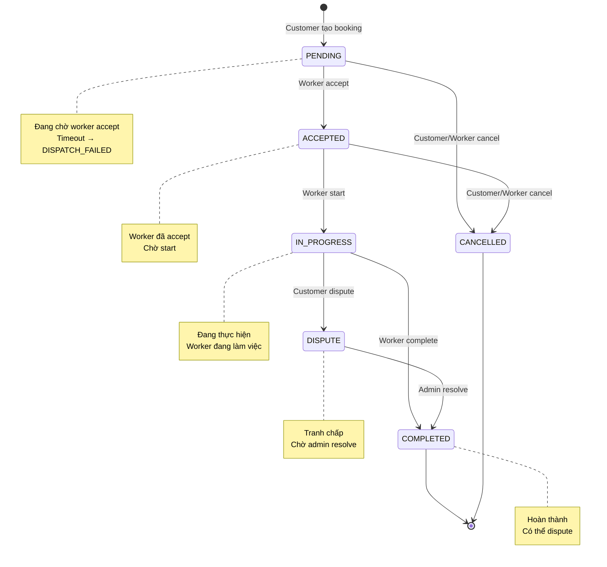

# Bookings — API Reference

## Tổng quan
Module đặt lịch (booking) bao gồm 12 endpoints cho việc tạo, quản lý và theo dõi trạng thái đặt lịch. Bao gồm cả quote (báo giá) flow.

---

## 1. State Machine



### Trạng thái
- **PENDING:** Khách hàng đã tạo, chờ worker accept
- **ACCEPTED:** Worker đã accept, chờ start
- **IN_PROGRESS:** Worker đang thực hiện
- **COMPLETED:** Đã hoàn thành
- **CANCELLED:** Đã hủy
- **DISPUTE:** Khách hàng tạo tranh chấp
- **DISPATCH_FAILED:** Hệ thống không tìm được worker

---

## 2. Endpoints Chi Tiết

### 2.1. Lấy Danh Sách Đặt Lịch
**GET** `/api/v1/bookings`

| Thuộc tính | Giá trị |
|---|---|
| **Auth** | Bearer JWT |
| **Query Params** | page, size, status, fromDate, toDate |
| **Success** | 200 + `ApiResponse<PagedResponse<BookingResponse>>` |

**Query Parameters:**
- `page` (int, default 0): Số trang
- `size` (int, default 20): Kích thước trang
- `status` (string, optional): Lọc theo trạng thái
- `fromDate` (string, optional): Từ ngày (ISO format)
- `toDate` (string, optional): Đến ngày (ISO format)

**Response:**
```json
{
  "status": 200,
  "data": {
    "content": [
      {
        "requestId": "uuid",
        "customerId": "uuid",
        "categoryId": "uuid",
        "assignedWorkerId": "uuid",
        "status": "PENDING",
        "estimatedPrice": "500000",
        "finalPrice": null,
        "description": "Máy lạnh không mát",
        "addressDetail": "123 Đường ABC",
        "scheduledTime": "2026-08-15T09:00:00Z",
        "createdAt": "2026-08-11T10:30:00Z",
        "updatedAt": "2026-08-11T10:30:00Z"
      }
    ],
    "page": 0,
    "size": 20,
    "totalItems": 1,
    "totalPages": 1
  }
}
```

---

### 2.2. Ước Tính Giá
**POST** `/api/v1/bookings/estimate`

| Thuộc tính | Giá trị |
|---|---|
| **Auth** | Bearer JWT |
| **Request** | `EstimateRequest` |
| **Success** | 200 + `ApiResponse<EstimateResponse>` |
| **Errors** | HS-404-0003 |

**Request Body:**
```json
{
  "categoryId": "uuid",           // required
  "description": "Mô tả vấn đề"  // required
}
```

**Response:**
```json
{
  "status": 200,
  "data": {
    "categoryId": "uuid",
    "categoryName": "Sửa máy lạnh",
    "estimatedPrice": "500000",
    "commissionFee": "50000",
    "totalEstimated": "550000"
  }
}
```

---

### 2.3. Tạo Đặt Lịch
**POST** `/api/v1/bookings`

| Thuộc tính | Giá trị |
|---|---|
| **Auth** | Bearer JWT (CUSTOMER) |
| **Request** | `CreateBookingRequest` |
| **Success** | 201 + `ApiResponse<BookingResponse>` |
| **Errors** | HS-400-0002, HS-400-0003, HS-404-0003 |

**Request Body:**
```json
{
  "categoryId": "uuid",              // required
  "description": "Mô tả vấn đề",    // required
  "addressDetail": "123 Đường ABC",  // required
  "locationLat": 10.762622,          // required
  "locationLng": 106.660172,         // required
  "scheduledTime": "2026-08-15T09:00:00Z",  // required
  "applianceId": "uuid",            // optional
  "deviceIp": "192.168.1.100"       // optional (cho thiết bị IoT)
}
```

**Lưu ý:**
- `scheduledTime` phải ở tương lai
- `locationLat/Lng` phải hợp lệ (VD: Việt Nam: lat 8-23, lng 102-110)

---

### 2.4. Worker Accept
**POST** `/api/v1/bookings/{id}/accept`

| Thuộc tính | Giá trị |
|---|---|
| **Auth** | Bearer JWT (WORKER) |
| **Header** | `X-Idempotency-Key: <uuid>` (BẮT BUỘC) |
| **Success** | 200 + `ApiResponse<StatusTransitionResponse>` |
| **Errors** | HS-400-0010, HS-400-0011, HS-404-0010 |

**Response:**
```json
{
  "status": 200,
  "data": {
    "requestId": "uuid",
    "previousStatus": "PENDING",
    "newStatus": "ACCEPTED",
    "timestamp": "2026-08-11T10:30:00Z"
  }
}
```

**Idempotency:**
- BẮT BUỘC gửi header `X-Idempotency-Key`
- Generate UUID phía client
- Nếu thiếu → `HS-400-0011`

---

### 2.5. Worker Start
**POST** `/api/v1/bookings/{id}/start`

| Thuộc tính | Giá trị |
|---|---|
| **Auth** | Bearer JWT (WORKER) |
| **Header** | `X-Idempotency-Key: <uuid>` (BẮT BUỘC) |
| **Success** | 200 + `ApiResponse<StatusTransitionResponse>` |
| **Errors** | HS-400-0010, HS-400-0011 |

---

### 2.6. Worker Complete
**POST** `/api/v1/bookings/{id}/complete`

| Thuộc tính | Giá trị |
|---|---|
| **Auth** | Bearer JWT (WORKER) |
| **Header** | `X-Idempotency-Key: <uuid>` (BẮT BUỘC) |
| **Request** | `CompleteBookingRequest` |
| **Success** | 200 + `ApiResponse<StatusTransitionResponse>` |
| **Errors** | HS-400-0010, HS-400-0011, HS-400-0012, HS-400-0013 |

**Request Body:**
```json
{
  "actualPrice": "600000"  // required
}
```

**Lưu ý:**
- `actualPrice` không được vượt quá `estimatedPrice * 1.5` (HS-400-0012)
- Nếu booking đã complete → `HS-400-0013`

---

### 2.7. Cancel
**POST** `/api/v1/bookings/{id}/cancel`

| Thuộc tính | Giá trị |
|---|---|
| **Auth** | Bearer JWT (CUSTOMER hoặc WORKER) |
| **Header** | `X-Idempotency-Key: <uuid>` (BẮT BUỘC) |
| **Success** | 200 + `ApiResponse<StatusTransitionResponse>` |
| **Errors** | HS-400-0010, HS-400-0011 |

---

### 2.8. Customer Dispute
**POST** `/api/v1/bookings/{id}/dispute`

| Thuộc tính | Giá trị |
|---|---|
| **Auth** | Bearer JWT (CUSTOMER) |
| **Header** | `X-Idempotency-Key: <uuid>` (BẮT BUỘC) |
| **Success** | 200 + `ApiResponse<StatusTransitionResponse>` |
| **Errors** | HS-400-0010, HS-400-0011, HS-400-0014 |

**Lưu ý:**
- Chỉ có thể dispute khi booking ở trạng thái `COMPLETED`
- Nếu booking chưa complete → `HS-400-0014`

---

### 2.9. Admin Resolve Dispute
**POST** `/api/v1/bookings/{id}/resolve-dispute`

| Thuộc tính | Giá trị |
|---|---|
| **Auth** | Bearer JWT (ADMIN) |
| **Header** | `X-Idempotency-Key: <uuid>` (BẮT BUỘC) |
| **Request** | `ResolveDisputeRequest` |
| **Success** | 200 + `ApiResponse<StatusTransitionResponse>` |
| **Errors** | HS-400-0010, HS-400-0011, HS-400-0015 |

**Request Body:**
```json
{
  "resolution": "Mô tả cách giải quyết",  // required
  "finalPrice": "500000"                  // required
}
```

---

## 3. Quote (Báo Giá) Flow

### 3.1. Worker Submit Quote
**POST** `/api/v1/bookings/{id}/quote`

| Thuộc tính | Giá trị |
|---|---|
| **Auth** | Bearer JWT (WORKER) |
| **Request** | `SubmitQuoteRequest` |
| **Success** | 200 + `ApiResponse<QuoteResponse>` |
| **Errors** | HS-400-0010 |

**Request Body:**
```json
{
  "items": [
    {
      "itemName": "Linh kiện ABC",
      "amount": "200000",
      "receiptUrl": "https://..."
    }
  ],
  "evidencePhotoUrls": [
    "https://...",
    "https://..."
  ]
}
```

**Response:**
```json
{
  "status": 200,
  "data": {
    "id": "uuid",
    "bookingId": "uuid",
    "workerId": "uuid",
    "items": [
      {
        "itemName": "Linh kiện ABC",
        "amount": "200000",
        "receiptUrl": "https://..."
      }
    ],
    "totalAmount": "200000",
    "status": "PENDING",
    "createdAt": "2026-08-11T10:30:00Z"
  }
}
```

---

### 3.2. Customer Approve Quote
**POST** `/api/v1/bookings/{id}/quote/approve`

| Thuộc tính | Giá trị |
|---|---|
| **Auth** | Bearer JWT (CUSTOMER) |
| **Success** | 200 + `ApiResponse<QuoteResponse>` |

---

### 3.3. Customer Reject Quote
**POST** `/api/v1/bookings/{id}/quote/reject`

| Thuộc tính | Giá trị |
|---|---|
| **Auth** | Bearer JWT (CUSTOMER) |
| **Success** | 200 + `ApiResponse<QuoteResponse>` |

---

## 4. DTO Summary

### 4.1. BookingResponse
```dart
class BookingResponse {
  final String requestId;
  final String customerId;
  final String categoryId;
  final String? assignedWorkerId;
  final BookingStatus status;
  final num? estimatedPrice;
  final num? finalPrice;
  final String description;
  final String addressDetail;
  final DateTime scheduledTime;
  final DateTime createdAt;
  final DateTime updatedAt;
}
```

### 4.2. StatusTransitionResponse
```dart
class StatusTransitionResponse {
  final String requestId;
  final BookingStatus previousStatus;
  final BookingStatus newStatus;
  final DateTime timestamp;
}
```

### 4.3. EstimateRequest
```dart
class EstimateRequest {
  final String categoryId;
  final String description;
}
```

### 4.4. EstimateResponse
```dart
class EstimateResponse {
  final String categoryId;
  final String categoryName;
  final num estimatedPrice;
  final num commissionFee;
  final num totalEstimated;
}
```

### 4.5. CreateBookingRequest
```dart
class CreateBookingRequest {
  final String categoryId;
  final String description;
  final String addressDetail;
  final double locationLat;
  final double locationLng;
  final DateTime scheduledTime;
  final String? applianceId;
  final String? deviceIp;
}
```

### 4.6. CompleteBookingRequest
```dart
class CompleteBookingRequest {
  final num actualPrice;
}
```

### 4.7. SubmitQuoteRequest
```dart
class SubmitQuoteRequest {
  final List<QuoteItem> items;
  final List<String> evidencePhotoUrls;
}

class QuoteItem {
  final String itemName;
  final num amount;
  final String? receiptUrl;
}
```

---

## 5. Idempotency Notes

### Endpoints yêu cầu Idempotency Key
- `POST /{id}/accept`
- `POST /{id}/start`
- `POST /{id}/complete`
- `POST /{id}/cancel`
- `POST /{id}/dispute`
- `POST /{id}/resolve-dispute`

### Cách implement
```dart
import 'package:uuid/uuid.dart';

class IdempotencyKeyGenerator {
  static final _uuid = Uuid();
  
  static String generate() => _uuid.v4();
}

// Sử dụng
final idempotencyKey = IdempotencyKeyGenerator.generate();
await api.post(
  '/bookings/$bookingId/accept',
  options: Options(
    headers: {'X-Idempotency-Key': idempotencyKey},
  ),
);
```

### Xử lý lỗi
- Thiếu header → `HS-400-0011`
- Key trùng lặp (trong thời gian ngắn) → Có thể retry an toàn

---

## 6. Cạm Bẫy và Lưu Ý

1. **ScheduledTime phải ở tương lai:** Nếu gửi thời gian quá khứ → `HS-400-0002`
2. **ActualPrice không được vượt quá:** estimatedPrice * 1.5 → `HS-400-0012`
3. **Dispute chỉ khi COMPLETED:** Nếu booking chưa complete → `HS-400-0014`
4. **Idempotency Key bắt buộc:** Cho tất cả POST state-change endpoints
5. **Worker chỉ accept/start/complete:** Customer không thể thực hiện các action này
6. **Admin resolve dispute:** Chỉ admin mới có quyền giải quyết tranh chấp

---

## 7. Ví Dụ Dart Code

### 7.1. Tạo Booking
```dart
class BookingRepository {
  final ApiClient _api;
  
  Future<BookingResponse> createBooking(CreateBookingRequest request) async {
    final response = await _api.post(
      '/bookings',
      data: request.toJson(),
    );
    
    final result = ApiResponse<BookingResponse>.fromJson(
      response.data,
      (json) => BookingResponse.fromJson(json),
    );
    
    return result.data!;
  }
}
```

### 7.2. Worker Accept với Idempotency
```dart
Future<StatusTransitionResponse> acceptBooking(String bookingId) async {
  final idempotencyKey = IdempotencyKeyGenerator.generate();
  
  final response = await _api.post(
    '/bookings/$bookingId/accept',
    options: Options(
      headers: {'X-Idempotency-Key': idempotencyKey},
    ),
  );
  
  final result = ApiResponse<StatusTransitionResponse>.fromJson(
    response.data,
    (json) => StatusTransitionResponse.fromJson(json),
  );
  
  return result.data!;
}
```

---

## Tài liệu liên quan
- [00-foundation.md](./00-foundation.md) — ApiResponse, Error Codes
- [03-categories-dispatch.md](./03-categories-dispatch.md) — Service Categories
- [05-wallet-payments.md](./05-wallet-payments.md) — Thanh toán sau booking