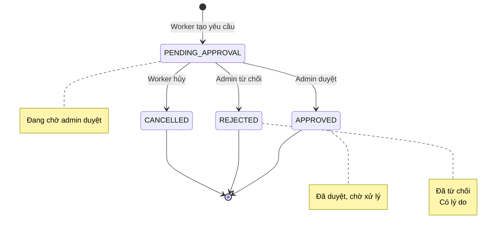

# Withdrawals — API Reference

## Tổng quan
Module quản lý yêu cầu rút tiền cho worker và admin.

---

## 1. Worker Flow

### 1.1. Tạo Yêu Cầu Rút Tiền
**POST** `/api/v1/wallets/withdrawals`

| Thuộc tính | Giá trị |
|---|---|
| **Auth** | Bearer JWT (WORKER) |
| **Request** | `WithdrawalRequestDTO` |
| **Success** | 200 + `ApiResponse<WithdrawalRequestResponse>` |
| **Errors** | HS-400-0020, HS-400-0021, HS-409-0002 |

**Request Body:**
```json
{
  "amount": "500000",              // required
  "bankCode": "VCB",              // required
  "bankAccountNumber": "1234567890"  // required
}
```

**Response:**
```json
{
  "status": 200,
  "data": {
    "id": "uuid",
    "workerId": "uuid",
    "amount": "500000",
    "bankCode": "VCB",
    "bankAccountNumber": "1234567890",
    "status": "PENDING_APPROVAL",
    "reason": null,
    "createdAt": "2026-08-11T10:30:00Z",
    "updatedAt": "2026-08-11T10:30:00Z"
  }
}
```

**Lưu ý:**
- `amount` không được vượt quá `balance` → `HS-400-0020`
- Nếu có withdrawal đang pending → `HS-400-0021`

---

### 1.2. Lấy Danh Sách Yêu Cầu (Worker)
**GET** `/api/v1/wallets/withdrawals`

| Thuộc tính | Giá trị |
|---|---|
| **Auth** | Bearer JWT (WORKER) |
| **Query Params** | page, size |
| **Success** | 200 + `ApiResponse<PagedResponse<WithdrawalRequestResponse>>` |

**Response:**
```json
{
  "status": 200,
  "data": {
    "content": [
      {
        "id": "uuid",
        "workerId": "uuid",
        "amount": "500000",
        "bankCode": "VCB",
        "bankAccountNumber": "1234567890",
        "status": "PENDING_APPROVAL",
        "reason": null,
        "createdAt": "2026-08-11T10:30:00Z",
        "updatedAt": "2026-08-11T10:30:00Z"
      }
    ],
    "page": 0,
    "size": 20,
    "totalItems": 1,
    "totalPages": 1
  }
}
```

**Lưu ý:**
- Endpoint này chỉ trả về withdrawal của user hiện tại

---

## 2. Admin Flow

### 2.1. Lấy Tất Cả Yêu Cầu (Admin)
**GET** `/api/v1/wallets/withdrawals/all`

| Thuộc tính | Giá trị |
|---|---|
| **Auth** | Bearer JWT (ADMIN) |
| **Query Params** | status, page, size |
| **Success** | 200 + `ApiResponse<PagedResponse<WithdrawalRequestResponse>>` |

**Query Parameters:**
- `status` (string, optional): PENDING_APPROVAL | APPROVED | REJECTED | CANCELLED
- `page` (int, default 0)
- `size` (int, default 20)

---

### 2.2. Duyệt Yêu Cầu
**PUT** `/api/v1/wallets/withdrawals/{id}/approve`

| Thuộc tính | Giá trị |
|---|---|
| **Auth** | Bearer JWT (ADMIN) |
| **Success** | 200 + `ApiResponse<WithdrawalRequestResponse>` |
| **Errors** | HS-404-0021, HS-400-0021 |

**Response:**
```json
{
  "status": 200,
  "data": {
    "id": "uuid",
    "workerId": "uuid",
    "amount": "500000",
    "bankCode": "VCB",
    "bankAccountNumber": "1234567890",
    "status": "APPROVED",
    "reason": null,
    "createdAt": "2026-08-11T10:30:00Z",
    "updatedAt": "2026-08-11T10:35:00Z"
  }
}
```

---

### 2.3. Từ Chối Yêu Cầu
**PUT** `/api/v1/wallets/withdrawals/{id}/reject`

| Thuộc tính | Giá trị |
|---|---|
| **Auth** | Bearer JWT (ADMIN) |
| **Request** | `WithdrawalRejectDTO` |
| **Success** | 200 + `ApiResponse<WithdrawalRequestResponse>` |
| **Errors** | HS-404-0021, HS-400-0021 |

**Request Body:**
```json
{
  "reason": "Thông tin tài khoản không hợp lệ"  // required, max 500 chars
}
```

**Response:**
```json
{
  "status": 200,
  "data": {
    "id": "uuid",
    "workerId": "uuid",
    "amount": "500000",
    "bankCode": "VCB",
    "bankAccountNumber": "1234567890",
    "status": "REJECTED",
    "reason": "Thông tin tài khoản không hợp lệ",
    "createdAt": "2026-08-11T10:30:00Z",
    "updatedAt": "2026-08-11T10:35:00Z"
  }
}
```

---

## 3. DTO Summary

### 3.1. WithdrawalRequestDTO
```dart
class WithdrawalRequestDTO {
  final num amount;
  final String bankCode;
  final String bankAccountNumber;
}
```

### 3.2. WithdrawalRequestResponse
```dart
class WithdrawalRequestResponse {
  final String id;
  final String workerId;
  final num amount;
  final String bankCode;
  final String bankAccountNumber;
  final WithdrawalStatus status;
  final String? reason;
  final DateTime createdAt;
  final DateTime updatedAt;
}
```

### 3.3. WithdrawalRejectDTO
```dart
class WithdrawalRejectDTO {
  final String reason;  // max 500 chars
}
```

---

## 4. Withdrawal Status Flow



---

## 5. Cạm Bẫy và Lưu Ý

1. **Worker chỉ xem được của mình:** Endpoint `GET /withdrawals` chỉ trả về withdrawal của user hiện tại
2. **Admin xem tất cả:** Endpoint `GET /withdrawals/all` cho admin
3. **Reason max 500 chars:** Khi reject, lý do tối đa 500 ký tự
4. **Status validation:** Không thể approve/reject withdrawal đã xử lý → `HS-400-0021`
5. **Not found:** Withdrawal không tồn tại → `HS-404-0021`
6. **Concurrent update:** Nếu có giao dịch đồng thời → `HS-409-0002`

---

## 6. Ví Dụ Dart Code

### 6.1. Worker Tạo Yêu Cầu
```dart
class WithdrawalRepository {
  final ApiClient _api;
  
  Future<WithdrawalRequestResponse> createWithdrawal({
    required num amount,
    required String bankCode,
    required String bankAccountNumber,
  }) async {
    final response = await _api.post(
      '/wallets/withdrawals',
      data: {
        'amount': amount.toString(),
        'bankCode': bankCode,
        'bankAccountNumber': bankAccountNumber,
      },
    );
    
    final result = ApiResponse<WithdrawalRequestResponse>.fromJson(
      response.data,
      (json) => WithdrawalRequestResponse.fromJson(json),
    );
    
    return result.data!;
  }
}
```

### 6.2. Admin Duyệt
```dart
Future<WithdrawalRequestResponse> approveWithdrawal(String id) async {
  final response = await _api.put('/wallets/withdrawals/$id/approve');
  
  final result = ApiResponse<WithdrawalRequestResponse>.fromJson(
    response.data,
    (json) => WithdrawalRequestResponse.fromJson(json),
  );
  
  return result.data!;
}
```

### 6.3. Admin Từ Chối
```dart
Future<WithdrawalRequestResponse> rejectWithdrawal({
  required String id,
  required String reason,
}) async {
  final response = await _api.put(
    '/wallets/withdrawals/$id/reject',
    data: {'reason': reason},
  );
  
  final result = ApiResponse<WithdrawalRequestResponse>.fromJson(
    response.data,
    (json) => WithdrawalRequestResponse.fromJson(json),
  );
  
  return result.data!;
}
```

---

## Tài liệu liên quan
- [00-foundation.md](./00-foundation.md) — ApiResponse, Error Codes
- [05-wallet-payments.md](./05-wallet-payments.md) — Wallet & Payments