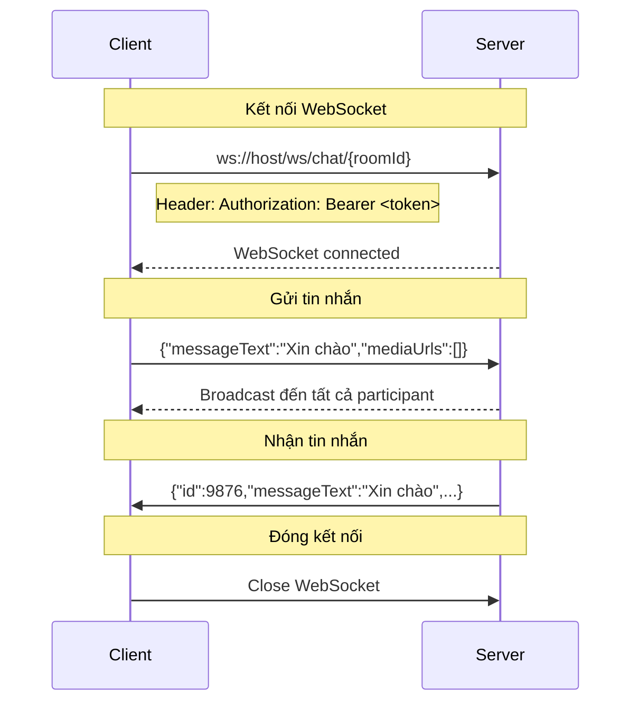

# Chat — API Reference

## Tổng quan
Module chat bao gồm REST API cho việc quản lý phòng chat và tin nhắn, cùng WebSocket cho real-time messaging.

> **roomId chung cho REST và WebSocket:** cả hai kênh đều dùng `roomId` kiểu **Long** (số, ví dụ `12345`). Mobile client lưu một `roomId` duy nhất và dùng cho cả REST lẫn WebSocket — không cần mapping hay convert.

---

## 1. REST API

### 1.1. Tạo Phòng Chat
**POST** `/api/v1/chat/rooms`

| Thuộc tính | Giá trị |
|---|---|
| **Auth** | Bearer JWT (CUSTOMER hoặc WORKER) |
| **Request** | `CreateRoomRequest` |
| **Success** | 200 + `ApiResponse<ChatRoomResponse>` |
| **Errors** | HS-404-0010, HS-409-0005 |

**Request Body:**
```json
{
  "bookingId": 30001
}
```

**Response:**
```json
{
  "status": 200,
  "data": {
    "id": 12345,
    "bookingId": 30001,
    "customerId": 20000,
    "workerId": 20001,
    "status": "ACTIVE"
  }
}
```

**Dart Model:**
```dart
class ChatRoomResponse {
  final int id;             // Long
  final int bookingId;
  final int customerId;
  final int workerId;
  final String status;      // ACTIVE, CLOSED
}
```

**Lưu ý:**
- Room chỉ tạo được khi booking ở trạng thái ACCEPTED hoặc IN_PROGRESS
- Nếu room đã tồn tại cho booking → trả về room hiện tại
- Nếu booking không tồn tại → `HS-404-0010`
- Nếu room đã đóng → `HS-409-0005`

---

### 1.2. Gửi Tin Nhắn (REST)
**POST** `/api/v1/chat/rooms/{roomId}/messages`

| Thuộc tính | Giá trị |
|---|---|
| **Auth** | Bearer JWT (participant) |
| **Path Param** | roomId (Long, số — ví dụ `12345`) |
| **Request** | `ChatMessageRequest` |
| **Success** | 200 + `ApiResponse<ChatMessageResponse>` |
| **Errors** | HS-403-0004, HS-409-0005 |

**Request Body:**
```json
{
  "messageText": "Xin chào",           // required
  "mediaUrls": ["https://..."]         // optional
}
```

**Response:**
```json
{
  "status": 200,
  "data": {
    "id": 9876,
    "roomId": 12345,
    "senderId": 20000,
    "messageText": "Xin chào",
    "mediaUrls": ["https://..."],
    "isRead": false,
    "sentAt": "2026-08-11T10:30:00Z"
  }
}
```

---

### 1.3. Lấy Tin Nhắn
**GET** `/api/v1/chat/rooms/{roomId}/messages`

| Thuộc tính | Giá trị |
|---|---|
| **Auth** | Bearer JWT (participant) |
| **Path Param** | roomId (Long, số) |
| **Query Params** | page, size |
| **Success** | 200 + `ApiResponse<ChatMessagePage>` |
| **Errors** | HS-403-0004 |

**Query Parameters:**
- `page` (int, default 0)
- `size` (int, default 50)

**Response:**
```json
{
  "status": 200,
  "data": {
    "messages": [
      {
        "id": 9876,
        "roomId": 12345,
        "senderId": 20000,
        "messageText": "Xin chào",
        "mediaUrls": [],
        "isRead": true,
        "sentAt": "2026-08-11T10:30:00Z"
      }
    ]
  }
}
```

**LƯU Ý QUAN TRỌNG:**
- Response là `ChatMessagePage` (KHÔNG phải `PagedResponse`)
- Chỉ có `messages` array, KHÔNG có `page`, `size`, `totalItems`, `totalPages`
- Client cần implement "load more" thủ công

---

## 2. WebSocket

### 2.1. Kết Nối
```
ws://host/ws/chat/{roomId}
```

**Authentication:**
- Gửi header `Authorization: Bearer <access_token>` khi handshake
- Không dùng subprotocol

**LƯU Ý:**
- `roomId` trong WebSocket path là **Long** (số, ví dụ: `/ws/chat/12345`)
- Cùng `roomId` được trả từ REST `POST /api/v1/chat/rooms` → dùng trực tiếp cho WebSocket, không cần convert

---

### 2.2. Message Format

#### Client → Server
```json
{
  "messageText": "Xin chào",
  "mediaUrls": ["https://..."]
}
```

**Dart Model:**
```dart
class ChatMessageRequest {
  final String messageText;
  final List<String>? mediaUrls;
  
  Map<String, dynamic> toJson() => {
    'messageText': messageText,
    if (mediaUrls != null) 'mediaUrls': mediaUrls,
  };
}
```

#### Server → Client (Broadcast)
```json
{
  "id": 9876,
  "roomId": 12345,
  "senderId": 20000,
  "messageText": "Xin chào",
  "mediaUrls": ["https://..."],
  "isRead": false,
  "sentAt": "2026-08-11T10:30:00Z"
}
```

**Dart Model:**
```dart
class ChatMessageResponse {
  final int id;
  final int roomId;
  final int senderId;
  final String messageText;
  final List<String> mediaUrls;
  final bool isRead;
  final DateTime sentAt;
}
```

---

### 2.3. Lifecycle



---

### 2.4. Error Contract

#### Authentication Error
```json
{
  "status": "error",
  "message": "Unauthorized",
  "errorCode": "HS-401-0001",
  "timestamp": "2026-08-11T10:30:00Z"
}
```

#### Forbidden Error
```json
{
  "status": "error",
  "message": "You don't have access to this chat room",
  "errorCode": "HS-403-0004",
  "timestamp": "2026-08-11T10:30:00Z"
}
```

#### Room Closed Error
```json
{
  "status": "error",
  "message": "Chat room is closed",
  "errorCode": "HS-409-0005",
  "timestamp": "2026-08-11T10:30:00Z"
}
```

---

### 2.5. Reconnect Strategy

```dart
class ChatWebSocket {
  WebSocketChannel? _channel;
  int _reconnectAttempts = 0;
  static const int _maxReconnectAttempts = 5;
  
  Future<void> connect(String roomId) async {
    final token = await _storage.getAccessToken();
    final wsUrl = 'ws://host/ws/chat/$roomId';
    
    _channel = WebSocketChannel.connect(
      Uri.parse(wsUrl),
      headers: {'Authorization': 'Bearer $token'},
    );
    
    _channel!.stream.listen(
      (message) => _handleMessage(message),
      onDone: () => _handleDisconnect(roomId),
      onError: (error) => _handleError(error),
    );
  }
  
  void _handleDisconnect(String roomId) {
    if (_reconnectAttempts < _maxReconnectAttempts) {
      _reconnectAttempts++;
      final delay = Duration(seconds: _reconnectAttempts * 2);
      Future.delayed(delay, () => connect(roomId));
    }
  }
}
```

---

## 3. Cạm Bẫy và Lưu Ý

### 3.1. Room ID Format
- Cả REST và WebSocket đều dùng **Long** (số, ví dụ `12345`)
- Lưu một `roomId` duy nhất từ response `POST /api/v1/chat/rooms` — dùng cho cả REST message API và `ws://host/ws/chat/{roomId}`
- KHÔNG cần mapping giữa REST và WebSocket

### 3.2. ChatMessagePage vs PagedResponse
- `ChatMessagePage` chỉ có `messages` array
- KHÔNG có pagination metadata
- Client cần implement infinite scroll thủ công

### 3.3. Media URLs
- `mediaUrls` là optional array
- Backend KHÔNG validate URL format
- Client cần validate trước khi gửi

### 3.4. isRead Field
- `isRead` chỉ có trong response, không có trong request
- Backend tự cập nhật khi participant đọc tin nhắn

### 3.5. WebSocket Authentication
- Phải gửi header `Authorization` khi handshake
- Nếu token hết hạn → kết nối bị reject

---

## 4. Ví Dụ Dart Code

### 4.1. Chat Repository
```dart
class ChatRepository {
  final ApiClient _api;
  
  Future<ChatRoomResponse> createRoom(int bookingId) async {
    final response = await _api.post(
      '/chat/rooms',
      data: {'bookingId': bookingId},
    );
    
    final result = ApiResponse<ChatRoomResponse>.fromJson(
      response.data,
      (json) => ChatRoomResponse.fromJson(json),
    );
    
    return result.data!;
  }
  
  Future<List<ChatMessageResponse>> getMessages({
    required int roomId,
    int page = 0,
    int size = 50,
  }) async {
    final response = await _api.get(
      '/chat/rooms/$roomId/messages',
      queryParameters: {'page': page, 'size': size},
    );
    
    final result = ApiResponse<ChatMessagePage>.fromJson(
      response.data,
      (json) => ChatMessagePage.fromJson(json),
    );
    
    return result.data!.messages;
  }
}
```

### 4.2. WebSocket Chat
```dart
class ChatWebSocketService {
  WebSocketChannel? _channel;
  final StreamController<ChatMessageResponse> _messageController = 
      StreamController<ChatMessageResponse>.broadcast();
  
  Stream<ChatMessageResponse> get messages => _messageController.stream;
  
  Future<void> connect(int roomId) async {
    final token = await _storage.getAccessToken();
    
    // roomId là Long, dùng chung cho REST và WebSocket
    final wsUrl = 'ws://host/ws/chat/$roomId';
    
    _channel = WebSocketChannel.connect(
      Uri.parse(wsUrl),
      headers: {'Authorization': 'Bearer $token'},
    );
    
    _channel!.stream.listen(
      (data) {
        final message = ChatMessageResponse.fromJson(
          jsonDecode(data),
        );
        _messageController.add(message);
      },
      onDone: () => _handleDisconnect(roomId),
    );
  }
  
  void sendMessage(ChatMessageRequest request) {
    _channel?.sink.add(jsonEncode(request.toJson()));
  }
  
  void disconnect() {
    _channel?.sink.close();
  }
}
```

---

## 5. Tài Liệu Liên Quan
- [00-foundation.md](./00-foundation.md) — ApiResponse, Error Codes
- [02-bookings.md](./02-bookings.md) — Booking tạo Chat Room
- [08-notifications.md](./08-notifications.md) — Thông báo tin nhắn mới