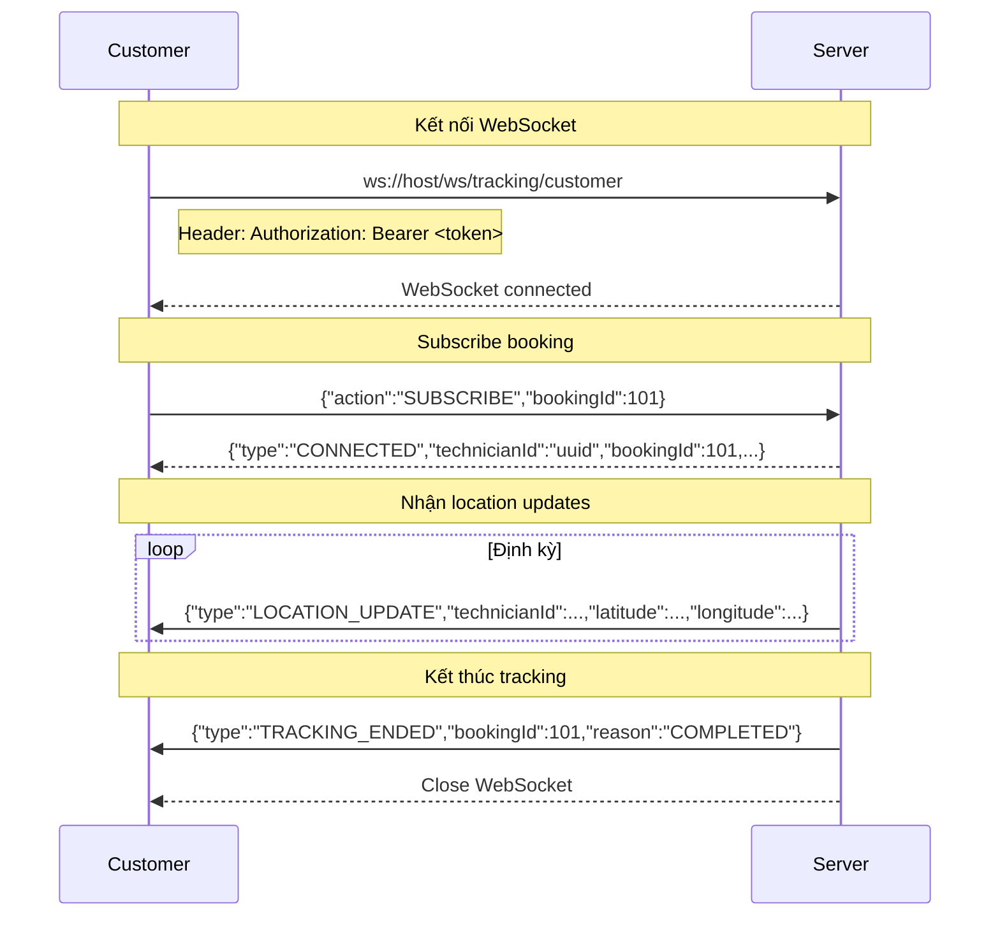
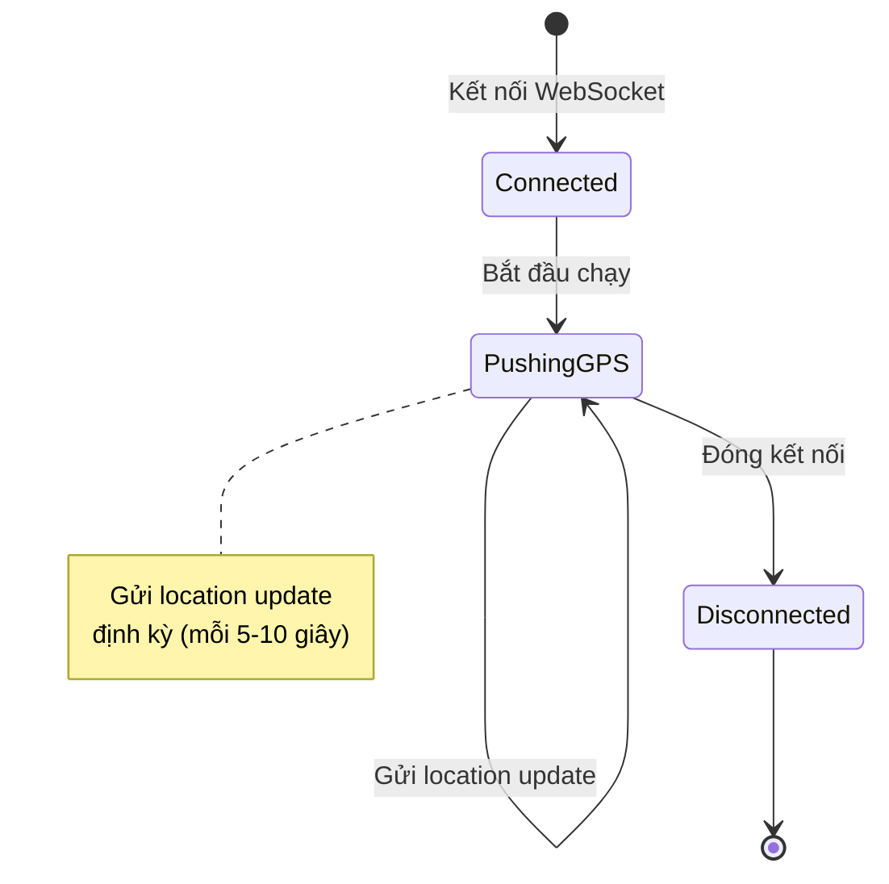
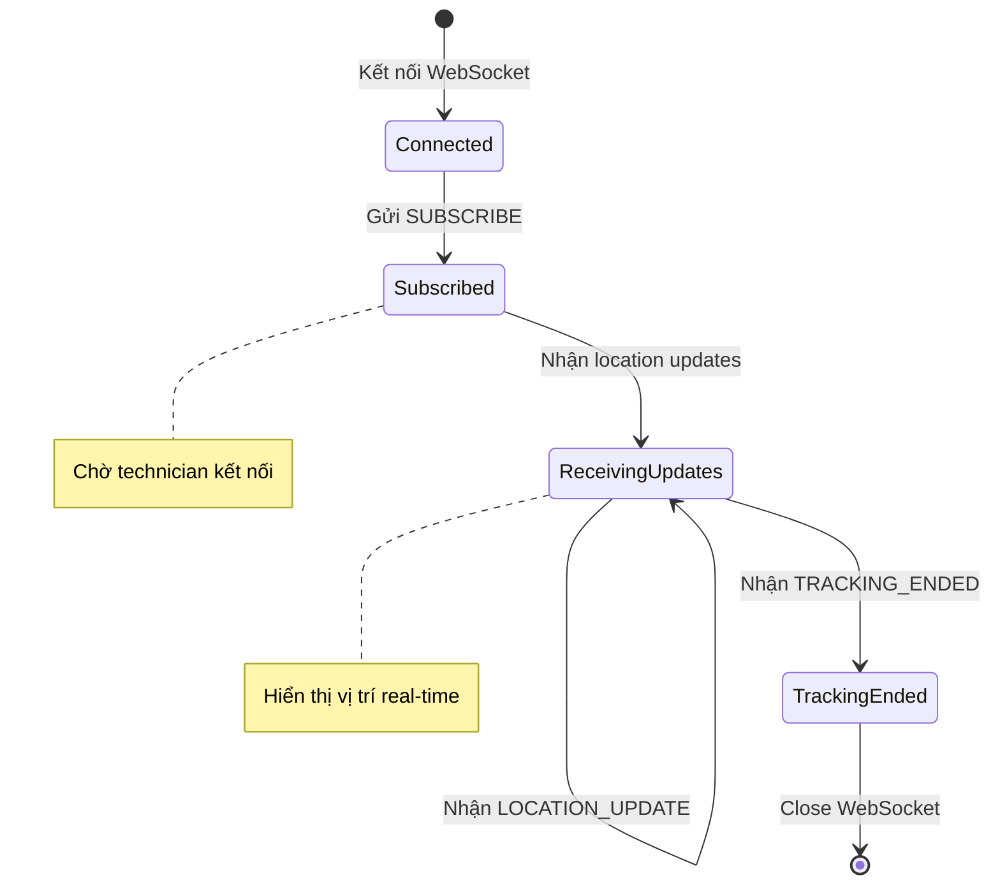

# Location Tracking — API Reference

## Tổng quan
Module theo dõi vị trí GPS của worker và khách hàng. Bao gồm REST API và WebSocket cho real-time tracking.

---

## 1. REST API

### 1.1. Cập Nhật Vị Trí Worker
**PUT** `/api/v1/technician/location`

| Thuộc tính | Giá trị |
|---|---|
| **Auth** | Bearer JWT (WORKER) |
| **Request** | `LocationUpdateRequest` |
| **Success** | 200 + `ApiResponse<Void>` |
| **Errors** | HS-400-0003 |

**Request Body:**
```json
{
  "technicianId": "uuid",     // BỊ SERVER IGNORE
  "latitude": 10.762622,      // required
  "longitude": 106.660172     // required
}
```

**Dart Model:**
```dart
class LocationUpdateRequest {
  final String technicianId;  // BỊ IGNORE bởi server
  final double latitude;
  final double longitude;
}
```

**⚠️ CỰC KỲ QUAN TRỌNG:**
- Field `technicianId` trong request body **BỊ SERVER IGNORE**
- Server lấy ID từ JWT token, KHÔNG cho phép impersonation
- Client có thể gửi `technicianId` hoặc không, server không quan tâm

---

## 2. WebSocket

### 2.1. Overview

Có 2 WebSocket endpoints cho location tracking:

| Endpoint | Vai trò | Mô tả |
|---|---|---|
| `/ws/tracking` | WORKER | Worker đẩy GPS location |
| `/ws/tracking/customer` | CUSTOMER | Customer theo dõi worker |

---

### 2.2. Worker Push GPS (`/ws/tracking`)

#### Kết Nối
```
ws://host/ws/tracking
```

**Authentication:**
- Gửi header `Authorization: Bearer <access_token>` khi handshake
- CHỈ worker mới có quyền kết nối

#### Client → Server (Location Update)
```json
{
  "technicianId": "uuid",
  "latitude": 10.762622,
  "longitude": 106.660172,
  "h3Index": "8742ea517ffffff",
  "lastUpdated": "2026-08-11T10:30:00Z",
  "status": "AVAILABLE"
}
```

**Dart Model:**
```dart
class LocationUpdateDTO {
  final String technicianId;
  final double latitude;
  final double longitude;
  final String? h3Index;      // BỊ SERVER IGNORE
  final DateTime lastUpdated;
  final String status;
}
```

**Lưu ý:**
- `h3Index` bị server ignore, server tự tính lại
- `status`: AVAILABLE | BUSY | OFFLINE

#### Server → Client (ACK)
```json
{
  "status": "ok",
  "h3Index": "8742ea517ffffff"
}
```

#### Server → Client (Error)
```json
{
  "status": "error",
  "message": "Invalid location",
  "errorCode": "HS-400-0003",
  "timestamp": "2026-08-11T10:30:00Z"
}
```

---

### 2.3. Customer Subscribe Tracking (`/ws/tracking/customer`)

#### Kết Nối
```
ws://host/ws/tracking/customer
```

**Authentication:**
- Gửi header `Authorization: Bearer <access_token>` khi handshake
- CHỈ customer mới có quyền kết nối

#### Message Flow



#### Client → Server (Subscribe)
```json
{
  "action": "SUBSCRIBE",
  "bookingId": 101
}
```

**Dart Model:**
```dart
class TrackingSubscribeRequest {
  final String action;      // Luôn là "SUBSCRIBE"
  final int bookingId;
}
```

#### Server → Client Messages

##### CONNECTED
```json
{
  "type": "CONNECTED",
  "technicianId": "uuid",
  "bookingId": 101,
  "latitude": 10.762622,
  "longitude": 106.660172,
  "heading": 90.0,
  "lastUpdated": "2026-08-11T10:30:00Z"
}
```

##### LOCATION_UPDATE
```json
{
  "type": "LOCATION_UPDATE",
  "technicianId": "uuid",
  "latitude": 10.762622,
  "longitude": 106.660172,
  "heading": 90.0,
  "lastUpdated": "2026-08-11T10:30:00Z",
  "bookingId": null,
  "reason": null
}
```

##### TRACKING_ENDED
```json
{
  "type": "TRACKING_ENDED",
  "bookingId": 101,
  "reason": "COMPLETED"
}
```

##### ERROR
```json
{
  "type": "ERROR",
  "message": "Not authorized to track this booking",
  "errorCode": "HS-403-0001"
}
```

**Dart Model:**
```dart
class TrackingMessage {
  final String type;  // CONNECTED | LOCATION_UPDATE | TRACKING_ENDED | ERROR
  final String? technicianId;
  final int? bookingId;
  final double? latitude;
  final double? longitude;
  final double? heading;
  final DateTime? lastUpdated;
  final String? reason;
  final String? message;
  final String? errorCode;
}
```

#### Type Enum
```dart
enum TrackingMessageType {
  connected('CONNECTED'),
  locationUpdate('LOCATION_UPDATE'),
  trackingEnded('TRACKING_ENDED'),
  error('ERROR');
  
  final String value;
  const TrackingMessageType(this.value);
}
```

---

### 2.4. Error Conditions

| Điều kiện | Phản hồi |
|---|---|
| Không phải customer | ERROR + Close |
| Booking chưa ACCEPTED/IN_PROGRESS | ERROR + Close |
| Customer không phải chủ booking | ERROR + Close |
| Token hết hạn | Reject handshake |

---

## 3. Lifecycle

### 3.1. Worker Flow


### 3.2. Customer Flow


---

## 4. Cạm Bẫy và Lưu Ý

1. **technicianId bị ignore:**
   - Ở REST `PUT /technician/location`, server ignore `technicianId`
   - Server lấy ID từ JWT token
   - KHÔNG cho phép impersonation

2. **h3Index bị ignore:**
   - Ở WebSocket `/ws/tracking`, `h3Index` bị server ignore
   - Server tự tính lại H3 index từ lat/lng

3. **bookingId là int:**
   - Ở WebSocket, `bookingId` là **int** (101), không phải UUID
   - REST API dùng UUID cho bookingId

4. **Customer chỉ track được booking của mình:**
   - Nếu customer không phải chủ booking → ERROR + Close

5. **Booking phải ở trạng thái đúng:**
   - Chỉ track được khi booking ở ACCEPTED hoặc IN_PROGRESS
   - Nếu booking PENDING hoặc COMPLETED → ERROR

6. **TRACKING_ENDED rồi close:**
   - Server gửi TRACKING_ENDED rồi tự động close WebSocket
   - Client không cần gửi close

---

## 5. Ví Dụ Dart Code

### 5.1. Worker Location Service
```dart
class WorkerLocationService {
  WebSocketChannel? _channel;
  Timer? _locationTimer;
  
  Future<void> connect() async {
    final token = await _storage.getAccessToken();
    
    _channel = WebSocketChannel.connect(
      Uri.parse('ws://host/ws/tracking'),
      headers: {'Authorization': 'Bearer $token'},
    );
    
    _channel!.stream.listen(
      (data) => _handleMessage(data),
      onDone: () => _handleDisconnect(),
    );
    
    // Bắt đầu gửi location update
    _startLocationUpdates();
  }
  
  void _startLocationUpdates() {
    _locationTimer = Timer.periodic(Duration(seconds: 5), (_) {
      _sendLocationUpdate();
    });
  }
  
  void _sendLocationUpdate() async {
    final position = await Geolocator.getCurrentPosition();
    
    final update = LocationUpdateDTO(
      technicianId: '',  // Server ignore field này
      latitude: position.latitude,
      longitude: position.longitude,
      lastUpdated: DateTime.now().toUtc(),
      status: 'AVAILABLE',
    );
    
    _channel?.sink.add(jsonEncode(update.toJson()));
  }
}
```

### 5.2. Customer Tracking Service
```dart
class CustomerTrackingService {
  WebSocketChannel? _channel;
  final StreamController<TrackingMessage> _messageController = 
      StreamController<TrackingMessage>.broadcast();
  
  Stream<TrackingMessage> get messages => _messageController.stream;
  
  Future<void> connect(int bookingId) async {
    final token = await _storage.getAccessToken();
    
    _channel = WebSocketChannel.connect(
      Uri.parse('ws://host/ws/tracking/customer'),
      headers: {'Authorization': 'Bearer $token'},
    );
    
    _channel!.stream.listen(
      (data) {
        final message = TrackingMessage.fromJson(jsonDecode(data));
        _messageController.add(message);
        
        if (message.type == TrackingMessageType.trackingEnded) {
          disconnect();
        }
      },
      onDone: () => _handleDisconnect(),
    );
    
    // Subscribe booking
    subscribe(bookingId);
  }
  
  void subscribe(int bookingId) {
    _channel?.sink.add(jsonEncode({
      'action': 'SUBSCRIBE',
      'bookingId': bookingId,
    }));
  }
  
  void disconnect() {
    _channel?.sink.close();
  }
}
```

---

## 6. Tài Liệu Liên Quan
- [00-foundation.md](./00-foundation.md) — ApiResponse, Error Codes
- [02-bookings.md](./02-bookings.md) — Booking status cho tracking
- [10-voip.md](./10-voip.md) — VoIP calls trong quá trình tracking