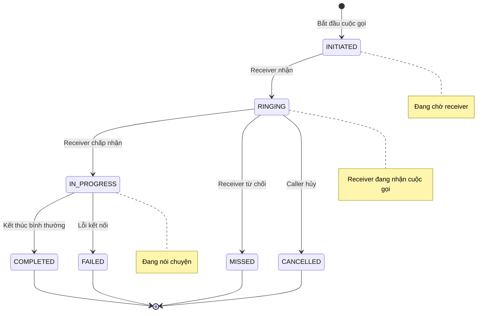

# VoIP — API Reference

## Tổng quan
Module cuộc gọi voice over IP (VoIP) cho phép customer và worker gọi điện trực tiếp qua ứng dụng.

---

## 1. REST API Endpoints

### 1.1. Bắt Đầu Cuộc Gọi
**POST** `/api/v1/voip/calls`

| Thuộc tính | Giá trị |
|---|---|
| **Auth** | Bearer JWT (CUSTOMER hoặc WORKER) |
| **Request** | `StartCallRequest` |
| **Success** | 201 + `ApiResponse<VoipCallResponse>` |
| **Errors** | HS-404-0010 |

**Request Body:**
```json
{
  "bookingId": "uuid",      // required
  "callerId": "uuid",       // required
  "receiverId": "uuid"      // required
}
```

**Response:**
```json
{
  "status": 201,
  "data": {
    "id": "uuid",
    "bookingId": "uuid",
    "callerId": "uuid",
    "receiverId": "uuid",
    "status": "INITIATED",
    "durationSeconds": null,
    "recordingUrl": null,
    "startedAt": "2026-08-11T10:30:00Z",
    "endedAt": null
  }
}
```

**Dart Model:**
```dart
class VoipCallResponse {
  final String id;
  final String bookingId;
  final String callerId;
  final String receiverId;
  final String status;
  final int? durationSeconds;
  final String? recordingUrl;
  final DateTime startedAt;
  final DateTime? endedAt;
}
```

---

### 1.2. Kết Thúc Cuộc Gọi
**POST** `/api/v1/voip/calls/end`

| Thuộc tính | Giá trị |
|---|---|
| **Auth** | Bearer JWT (participant) |
| **Request** | `EndCallRequest` |
| **Success** | 200 + `ApiResponse<VoipCallResponse>` |

**Request Body:**
```json
{
  "callId": "uuid",              // required
  "durationSeconds": 120,       // required
  "recordingUrl": "https://..." // optional
}
```

**Dart Model:**
```dart
class EndCallRequest {
  final String callId;
  final int durationSeconds;
  final String? recordingUrl;
}
```

---

### 1.3. Lấy Danh Sách Cuộc Gọi
**GET** `/api/v1/voip/calls`

| Thuộc tính | Giá trị |
|---|---|
| **Auth** | Bearer JWT (participant) |
| **Query Params** | bookingId |
| **Success** | 200 + `ApiResponse<List<VoipCallResponse>>` |

**Query Parameters:**
- `bookingId` (string, optional): Lọc theo booking

**Response:**
```json
{
  "status": 200,
  "data": [
    {
      "id": "uuid",
      "bookingId": "uuid",
      "callerId": "uuid",
      "receiverId": "uuid",
      "status": "COMPLETED",
      "durationSeconds": 120,
      "recordingUrl": "https://...",
      "startedAt": "2026-08-11T10:30:00Z",
      "endedAt": "2026-08-11T10:32:00Z"
    }
  ]
}
```

**Lưu ý:**
- Chỉ trả về cuộc gọi mà user hiện tại là participant (caller hoặc receiver)
- Nếu không có `bookingId`, trả về tất cả cuộc gọi của user

---

## 2. Admin Endpoints

### 2.1. Lấy Recording URL
**GET** `/api/v1/admin/voip/calls/{callId}/recording`

| Thuộc tính | Giá trị |
|---|---|
| **Auth** | Bearer JWT (ADMIN) |
| **Success** | 200 + `ApiResponse<String>` |
| **Errors** | HS-403-0005, HS-404-0001 |

**Response:**
```json
{
  "status": 200,
  "data": "https://storage.example.com/recordings/call-uuid.wav"
}
```

**Lưu ý:**
- CHỈ admin mới có quyền truy cập recording
- Participant không có quyền → `HS-403-0005`

---

## 3. Call Status Flow



### Status Values
```dart
enum CallStatus {
  initiated('INITIATED'),
  ringing('RINGING'),
  inProgress('IN_PROGRESS'),
  completed('COMPLETED'),
  missed('MISSED'),
  cancelled('CANCELLED'),
  failed('FAILED');
  
  final String value;
  const CallStatus(this.value);
}
```

---

## 4. Cạm Bẫy và Lưu Ý

1. **Recording chỉ admin mới xem được:**
   - Participant KHÔNG có quyền xem recording
   - Phải qua endpoint admin

2. **durationSeconds là required khi end:**
   - Phải tính thời gian thực tế
   - Nếu không có → lỗi validation

3. **recordingUrl là optional:**
   - Backend không bắt buộc recording
   - Mobile có thể gửi hoặc không

4. **Call participant validation:**
   - Chỉ caller và receiver mới có quyền end call
   - Người khác gọi → `HS-403-0001`

5. **bookingId validation:**
   - Booking phải tồn tại → `HS-404-0010`
   - Participant phải là customer hoặc worker của booking

---

## 5. Ví Dụ Dart Code

### 5.1. VoIP Repository
```dart
class VoipRepository {
  final ApiClient _api;
  
  Future<VoipCallResponse> startCall({
    required String bookingId,
    required String callerId,
    required String receiverId,
  }) async {
    final response = await _api.post(
      '/voip/calls',
      data: {
        'bookingId': bookingId,
        'callerId': callerId,
        'receiverId': receiverId,
      },
    );
    
    final result = ApiResponse<VoipCallResponse>.fromJson(
      response.data,
      (json) => VoipCallResponse.fromJson(json),
    );
    
    return result.data!;
  }
  
  Future<VoipCallResponse> endCall({
    required String callId,
    required int durationSeconds,
    String? recordingUrl,
  }) async {
    final response = await _api.post(
      '/voip/calls/end',
      data: {
        'callId': callId,
        'durationSeconds': durationSeconds,
        if (recordingUrl != null) 'recordingUrl': recordingUrl,
      },
    );
    
    final result = ApiResponse<VoipCallResponse>.fromJson(
      response.data,
      (json) => VoipCallResponse.fromJson(json),
    );
    
    return result.data!;
  }
  
  Future<List<VoipCallResponse>> getCalls({String? bookingId}) async {
    final response = await _api.get(
      '/voip/calls',
      queryParameters: if (bookingId != null) {'bookingId': bookingId},
    );
    
    // Response là List trực tiếp, không phải PagedResponse
    final List<dynamic> data = response.data['data'];
    return data.map((json) => VoipCallResponse.fromJson(json)).toList();
  }
}
```

---

## 6. Tài Liệu Liên Quan
- [00-foundation.md](./00-foundation.md) — ApiResponse, Error Codes
- [02-bookings.md](./02-bookings.md) — Booking cho VoIP calls
- [09-location-tracking.md](./09-location-tracking.md) — Location tracking trong quá trình gọi